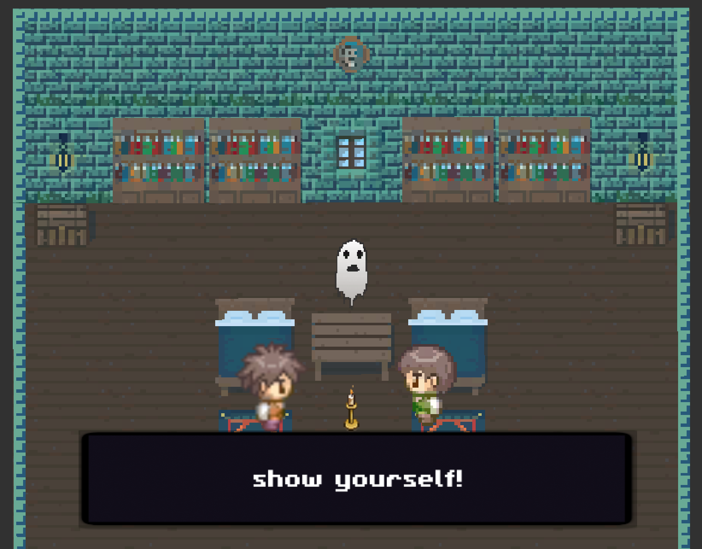
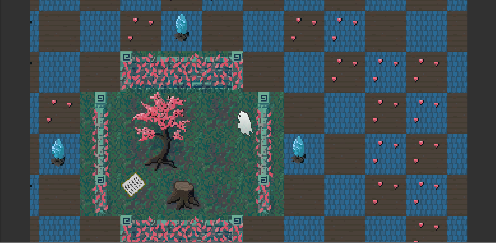
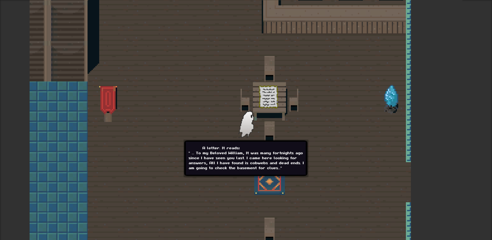

# **Unfinished (business)**

#### Authors: **_Jessica Hvozdovich, Ethan Firpo, Christopher Huber, Brevin Cronk_**
#### June 18, 2020



### Description

[Play a partial demo here!](https://jhvozdovich.github.io/unfinished/)

_From the makers of [Stardew Harvest Crossing](https://github.com/jhvozdovich/stardew_harvest_crossing) and [The Experiment](https://github.com/efirpo/horrorrpg)_

_Unfinished is a 2D RPG built using the Unity Engine. The user plays as a ghost who is summoned by two NPCs to help them find a secret amulet. Gameplay consists of moving through different levels following clues and solving puzzles to reveal the truth!_

### Instructions for use:
The majority of the game is hosted through WebGL and GHPages [here](https://jhvozdovich.github.io/unfinished/)

The full game is undergoing build troubleshooting. It can be played in full locally, but opening cutscenes are not currently compatible with WebGL hosting. To access and edit the source code:

1. Download Unity [here](https://store.unity.com/download-nuo)
* This project was made in Unity 2019.4.0f1 but can be updated after upload if a newer version is being used.
2. Clone the repository with the following commands:
```
cd Desktop
git clone https://github.com/jhvozdovich/unfinished.git
```
3. Open Unity Hub
4. Select Add
5. Select the cloned directory from your Desktop.
6. Select Create
7. To start the game from the beginning within Unity:
* Open the Project tab (Window > General > Project)
* Select the Assets folder
* Select the Scenes folder
* Select Scene MainMenu-0
* Press the Play button to start the game

Troubleshooting Notes
* All files must be added to build settings under File > Build Settings


### Known Bugs

Build files require large file storage on GitHub which complicates pushing and pulling. Tutorials on how to implement lfs can be found [here](https://git-lfs.github.com/).
Cutscene 1 is unable to run in WebGL
Barriers must be added to cutscene doors, player can walk off screen.

### Support and Contact Information

_Have a bug or an issue with this application? [Open a new issue](https://github.com/jhvozdovich/unfinished/issues) here on GitHub._

### Technologies Used

* C#
* Unity
* Git and GitHub

### User Story
<details>
<summary> Click to See User Story</summary>

* User wants to play a cute but spooky story driven game?
* User likes to browse Steam's "new" and "free" categories.
* User is feeling in a spooky detective game mood.
* User wants to be able to flow through the levels seamlessly.
* Boo.

</details>


### Specs
<details>
<summary>Expand to see the Specifications for the Project.</summary>

| Spec | Input | Output |
| :------------- | :------------- | :------------- |
| **User can move player** | User Input:"Up arrow" | Output: “Player moves up with up animation” |
| **User can navigate to different rooms** | User Input:"Navigate to door" | Output: “New scene” |
| **User can return to previous rooms** | User Input:"Navigate to door" | Output: "Previous scene” |
| **User can interact with environment to unlock new rooms** | User Input:"Click "space" near painting" | Output: “Painting straightens, room unlocks” |
| **Game has home screen** | User Input:"Load game" | Output: “Title screen” |
| **Game has ending scenes** | User Input:"Run into enemy" | Output: “Bad end scene” |
| **Game has ambient music** | User Input:"Start game" | Output: “Music plays in loop” |
| **Cutscene plays after initial room entry to prompt player's actions** | User Input:"Enter room" | Output: "Scene with twins and dialog boxes" |
| **User can pick up items and add them to inventory** | User Input:"Click "space" near book" | Output: “Book added to inventory” |

</details>

### Screenshots
<details>
<summary> Click here to see Screenshots.</summary>

#### The Bedroom!


#### The Tree Room!


#### The Great Hall!


</details>

### Stretch Goals
* Leveling system
* Login
* Dialog API
* Multiple endings
* Lives- three before total restart
* Save game
* Restart game
* Battle mechanics

#### Resources
* [Protagonist](https://opengameart.org/content/stendhal-ghost)
* [Backgrounds](https://blockydk.itch.io/twilight-village-rpg-tileset)
* [NPC Ghosts and Sparkles](https://v3x3d.itch.io/deep-night/devlog/123509/everything-is-new)
* [Music](https://opengameart.org/content/spooky-dungeon)
* [SFX](https://opengameart.org/content/misc-sfx-pack)
* [Necklace Sprite](https://opengameart.org/content/rings-and-necklaces-from-pixeltime-videos)
* [Human NPCs](https://pipoya.itch.io/pipoya-free-rpg-character-sprites-32x32)

#### License

This software is licensed under the MIT license.

Copyright © 2020 **_Jessica Hvozdovich, Ethan Firpo, Christopher Huber, Brevin Cronk_**